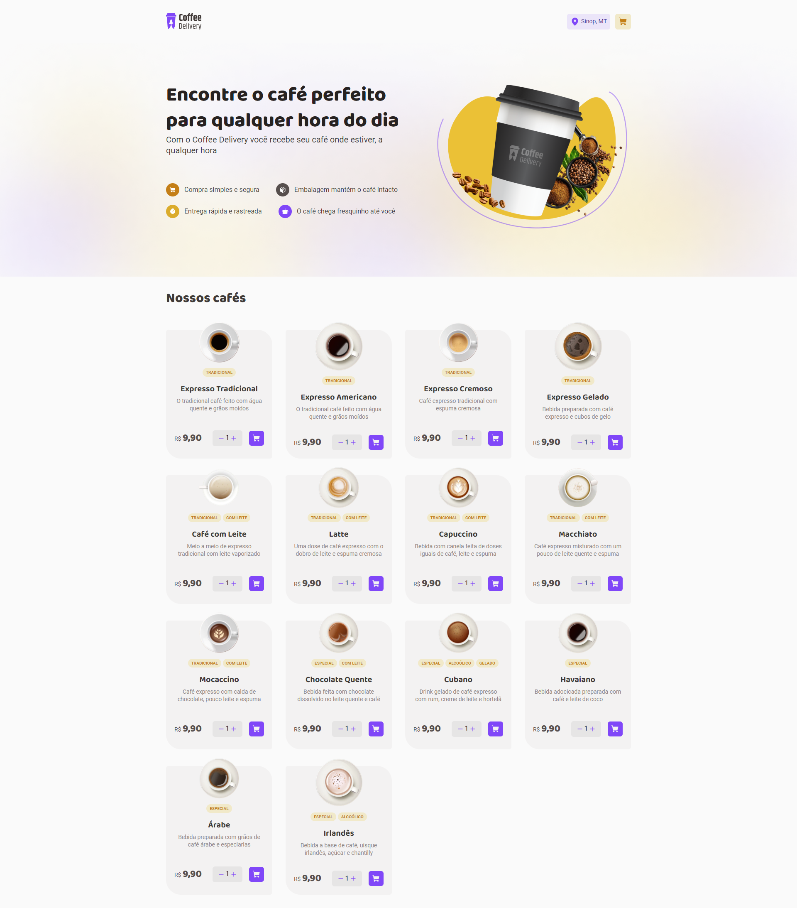
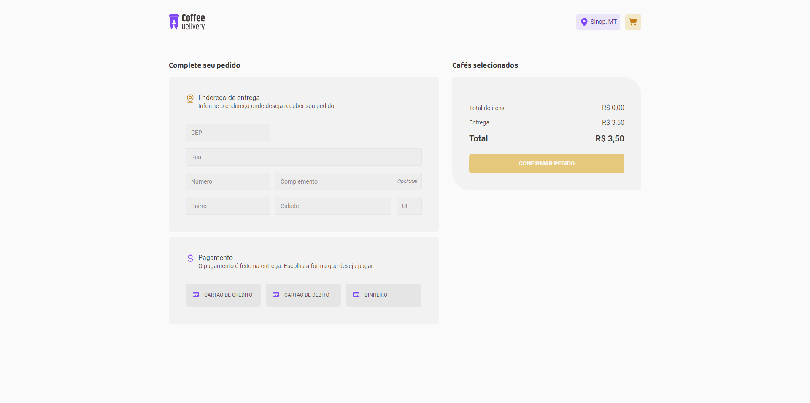

<h1 align="center">☕ Coffee Delivery</h1>

A coffee delivery website to practice ReactJS

<div align="center">
  <div style="display: flex; justify-content: space-between; align-items: center;">
	

	

	

	

	

	
  </div>
</div>


<h4 align="center"> 
	☕ Coffee Delivery | Done ✔️
</h4>

## 🚀 Concepts and features practiced

- useState
- State Immutability
- useEffect
- useContext
- useReducer
- Form Validation
- ZOD
- React Hook Form
- React Router DOM
- Styled Components
- Themes with Styled Components
  
## 💻 Features

- Add a product to the cart
- Remove a product from the cart
- Modify the quantity of a certain product in the cart
- Select payment method
- Finish the order

## Requirements to run the project

<p>Before you run the project, check if you have [Node.js](https://nodejs.org/en/) installed on your machine, as well [Git](https://git-scm.com) to clone this repository.</p>

## Running the application

```bash
    # Clone this repository on your machine:
    $ git clone https://github.com/vitorlinsbinski/coffee-delivery.git

    # Access the project folder in your terminal:
    $ cd coffee-delivery

    # Install all dependencies:
    $ npm install

    # Run the application:
    $ npm run dev
```

## Main Technologies

- [ReactJS](https://react.dev/)
- [Vite](https://vitejs.dev/)
- [TypeScript](https://www.typescriptlang.org/)
- [React Hook Form](https://www.react-hook-form.com/)
- [ZOD](https://zod.dev/)
- [Phosphor React](https://github.com/phosphor-icons/react)
- [Styled Components](https://styled-components.com/)
- [React Router DOM](https://reactrouter.com/en/main)

## Final Result

[Coffee Delivery Deploy](https://vitorlinsbinski.github.io/coffee-delivery) 

<h3>Home Page</h3>
</img>

<h3>Cart Page</h3>
</img>

### Author

<a href="https://github.com/vitorlinsbinski">
 
 <br />
 <sub><b>Vitor Linsbinski</b></sub></a> <a href="https://github.com/vitorlinsbinski" title="">🚀</a>

Developed by Vitor Linsbinski

[](https://www.linkedin.com/in/vitorlinsbinski/)


